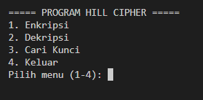
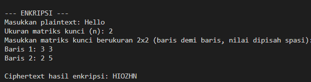
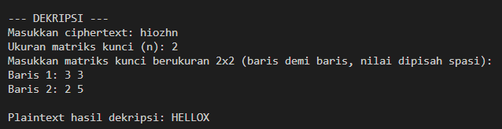
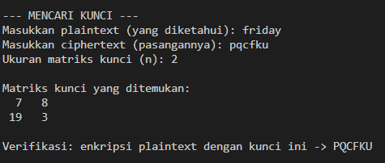

# Program Hill Cipher (Python)

Program interaktif berbasis menu untuk melakukan **enkripsi**, **dekripsi**, dan **pencarian kunci** (known-plaintext attack) pada Hill Cipher, menggunakan alfabet A-Z (26 karakter) dan aritmetika modulo 26.

## Fitur

1. **Enkripsi** — mengubah plaintext menjadi ciphertext menggunakan kunci matriks n×n.
2. **Dekripsi** — mengembalikan ciphertext menjadi plaintext menggunakan kunci matriks n×n yang sama.
3. **Cari Kunci** — menemukan matriks kunci K dari sepasang plaintext & ciphertext yang sudah diketahui.

---

## Alur Program

### 1. Struktur Umum

```
main()
 └── loop menu (1-4)
      ├── 1 -> menu_enkripsi()
      ├── 2 -> menu_dekripsi()
      ├── 3 -> menu_cari_kunci()
      └── 4 -> keluar dari program
```

Program berjalan dalam perulangan (`while True`) yang terus menampilkan menu sampai pengguna memilih **4 (Keluar)**.

### 2. Fungsi Utilitas Dasar

| Fungsi | Kegunaan |
|---|---|
| `bersihkan_teks(teks)` | Menghapus spasi/karakter non-huruf dan mengubah teks jadi huruf besar. |
| `teks_ke_angka(teks)` | Mengonversi huruf A-Z menjadi angka 0-25. |
| `angka_ke_teks(angka)` | Mengonversi angka kembali menjadi huruf, dengan modulo 26. |
| `invers_modulo(a, m)` | Mencari invers suatu bilangan `a` modulo `m` (brute force 1..m-1). |
| `determinan_matriks(matriks)` | Menghitung determinan matriks lalu mod 26. |
| `invers_matriks_modulo(matriks, m)` | Menghitung invers matriks (kofaktor → adjoin → dikalikan invers determinan) modulo `m`. |
| `baca_matriks_dari_input(n, nama)` | Membaca matriks n×n dari input pengguna, baris per baris. |
| `cetak_matriks(matriks, nama)` | Menampilkan matriks ke layar dengan format rapi. |

### 3. Alur Menu 1 — Enkripsi (`menu_enkripsi` → `enkripsi`)

1. Pengguna memasukkan **plaintext** dan **ukuran kunci n**.
2. Pengguna memasukkan matriks kunci n×n.
3. Fungsi `enkripsi()`:
   - Membersihkan plaintext (`bersihkan_teks`).
   - Melakukan **padding** dengan huruf `X` jika panjang teks belum kelipatan n.
   - Mengonversi teks ke angka (`teks_ke_angka`).
   - Membagi angka menjadi blok-blok berukuran n, lalu tiap blok dikalikan dengan matriks kunci: `C = K · P (mod 26)`.
   - Mengonversi hasil kembali menjadi teks (`angka_ke_teks`).
4. Ciphertext hasil enkripsi ditampilkan ke layar.

### 4. Alur Menu 2 — Dekripsi (`menu_dekripsi` → `dekripsi`)

1. Pengguna memasukkan **ciphertext** dan **matriks kunci** yang sama seperti saat enkripsi.
2. Fungsi `dekripsi()`:
   - Membersihkan ciphertext.
   - Memvalidasi panjang teks harus kelipatan n.
   - Menghitung **invers matriks kunci** modulo 26 (`invers_matriks_modulo`).
   - Setiap blok ciphertext dikalikan dengan invers kunci: `P = K⁻¹ · C (mod 26)`.
   - Hasil dikonversi kembali menjadi teks plaintext.
3. Jika matriks kunci tidak memiliki invers modulo 26 (determinan tidak coprime dengan 26), program menampilkan pesan kesalahan.

### 5. Alur Menu 3 — Cari Kunci (`menu_cari_kunci` → `cari_kunci`)

Menu ini melakukan **known-plaintext attack**: mencari matriks kunci K dari pasangan plaintext-ciphertext yang sudah diketahui, dengan rumus `K = C · P⁻¹ (mod 26)`.

Langkah-langkah:

1. Plaintext & ciphertext dibersihkan dan divalidasi (panjangnya harus sama dan minimal n² karakter).
2. Teks dipecah menjadi blok-blok berukuran n.
3. Program mencoba **semua kombinasi n blok** (bukan hanya n blok pertama) untuk membentuk matriks P:
   - Jika determinan matriks P tidak memiliki invers modulo 26 (yaitu `gcd(det, 26) != 1`), kombinasi itu dilewati.
   - Jika invers ditemukan, dihitung `K = C · P⁻¹ (mod 26)`.
4. Kunci kandidat tersebut **diverifikasi** dengan mengenkripsi ulang seluruh plaintext yang diberikan dan mencocokkannya dengan ciphertext asli.
5. Kombinasi pertama yang lolos verifikasi dikembalikan sebagai kunci final.
6. Jika tidak ada kombinasi yang berhasil, program meminta pasangan plaintext-ciphertext yang lebih panjang/beragam.

> Pendekatan mencoba banyak kombinasi ini penting karena tidak semua potongan plaintext menghasilkan matriks yang bisa dibalik modulo 26 (misalnya jika ada huruf berulang yang membuat matriks singular).

---

## Contoh Output Program

> Cuplikan teks di bawah adalah hasil eksekusi nyata (untuk referensi format). Tempat kosong bergambar (``) di bawah tiap contoh adalah **tempat untuk menyisipkan screenshot kamu sendiri** — cukup ganti nama filenya sesuai file gambar yang kamu simpan di folder yang sama dengan README ini (misalnya di dalam folder `screenshots/`).

### Menu Utama




### 1. Enkripsi




### 2. Dekripsi




*(Catatan: "HELLO" menjadi "HELLOX" karena panjangnya ganjil dan otomatis di-padding dengan huruf `X` saat enkripsi.)*

### 3. Cari Kunci




