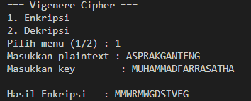
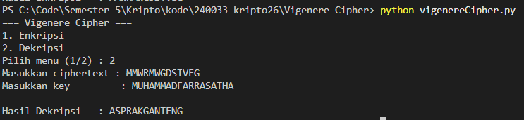

# Program Vigenere Cipher (Python)

Program interaktif berbasis menu untuk melakukan **enkripsi** dan **dekripsi** menggunakan Vigenere Cipher, dengan alfabet A-Z (26 karakter) dan aritmetika modulo 26.

## Fitur

1. **Enkripsi** — mengubah plaintext menjadi ciphertext menggunakan key.
2. **Dekripsi** — mengembalikan ciphertext menjadi plaintext menggunakan key yang sama.

---

## Alur Program

### 1. Struktur Umum

```
main
 └── menu (1-2)
      ├── 1 -> enkripsi
      └── 2 -> dekripsi
```

Program menampilkan menu sekali, lalu meminta input sesuai pilihan pengguna.

### 2. Fungsi Utilitas Dasar

| Fungsi | Kegunaan |
|---|---|
| `bersihkan_teks(teks)` | Menghapus spasi/karakter non-huruf dan mengubah teks jadi huruf besar. |
| `buat_keystream(teks, key)` | Memperpanjang key dengan cara diulang (looping) sepanjang teks. Jika key lebih panjang dari teks, kelebihan huruf key diabaikan. |
| `vigenere_enkripsi(plaintext, key)` | Mengenkripsi plaintext menggunakan rumus `C = (P + K) mod 26`. |
| `vigenere_dekripsi(ciphertext, key)` | Mendekripsi ciphertext menggunakan rumus `P = (C - K) mod 26`. |

### 3. Alur Menu 1 — Enkripsi

1. Pengguna memasukkan **plaintext** dan **key**.
2. Plaintext dibersihkan (`bersihkan_teks`).
3. Keystream dibentuk dari key sepanjang plaintext (`buat_keystream`).
4. Setiap huruf plaintext dikonversi ke angka (A=0 ... Z=25), dijumlahkan dengan huruf keystream yang bersesuaian, lalu di-mod 26.
5. Hasil angka dikonversi kembali menjadi huruf dan ditampilkan sebagai ciphertext.

### 4. Alur Menu 2 — Dekripsi

1. Pengguna memasukkan **ciphertext** dan **key** yang sama seperti saat enkripsi.
2. Ciphertext dibersihkan (`bersihkan_teks`).
3. Keystream dibentuk dari key sepanjang ciphertext (`buat_keystream`).
4. Setiap huruf ciphertext dikonversi ke angka, dikurangi dengan huruf keystream yang bersesuaian, lalu di-mod 26.
5. Hasil angka dikonversi kembali menjadi huruf dan ditampilkan sebagai plaintext.

---

## Contoh Output Program

### 1. Enkripsi



### 2. Dekripsi


